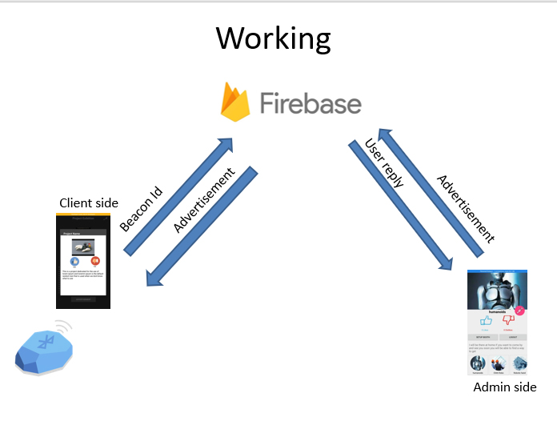
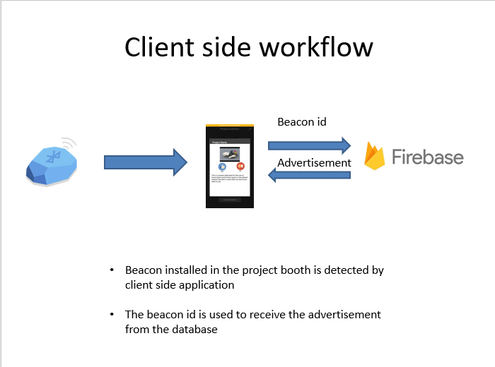
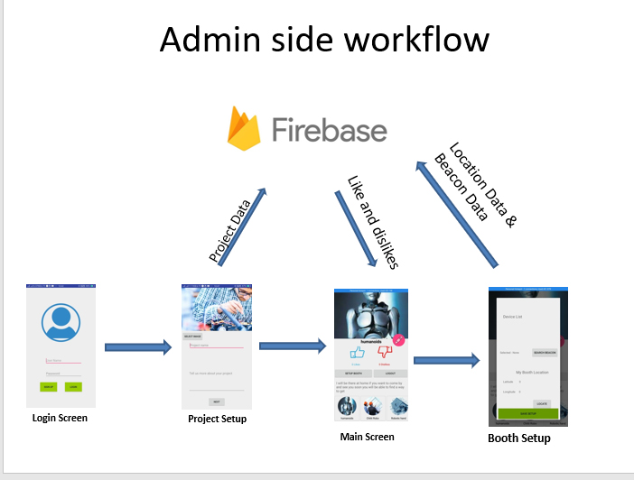

# Beacon Application

Introduction: Beacons are devices which can be used to deliver user specific customized advertisements. The advantages of using beacons
are that they are low powered BLE device which can last from a few weeks to upto several months on a single coin cell battery.
They are one of the key components in todays IOT devices as they provide low power connectivity for remote monitoring puposes.

The beacon used in this project belongs to the company bluvision who is a pioneer in manufacturing these devices.Two bluvisions ble powered
devices are used in this porject namely:
<ul>
<li>Blufi: These devices are powered via plug points and acts as the local hub for communication with other battery powered devices.
These devices help in efficiently help the beacon tags to connect to the internet on trigger events.</li>
<li>Beacon Tag: Battery powered BLE cards with upto 6-12 inbuilt sensors such as:<ul>
<li>Light sensor</li>
<li>Magnetic sensor</li>
<li>Gyro Sensor</li>
<li>accelerometer</li>
<li>etc....</li></ul></li>
</ul>

<h4>Project aim:</h4>
  This project as a proof of concept for using beacon id cards and blufis as a part of User experince enhancing tools for a college project 
  exibition.
  
  
  
  
  
  
  
  
  <h4>Developers:</h4>
  <ul><li>Rahul B George</li>
  <li>Madhavendra singh negi</li>
  <li>Jaswant kesaria</li></ul>
